# 第一章 Hadoop概述

## Hadoop是什么

1. Hadoop是一个由Apache基金会所开发的**分布式系统基础架构**

2. 主要解决，海量数据的存储和海量数据的**分析计算**问题

3. 广义上来说，Hadoop通常是指一个更广泛的概念——**Hadoop生态圈**

   

## Hadoop优势

1. 高可靠性：Hadoop底层维护多个数据副本，所以即使Hadoop某个计算元 素或存储出现故障，也不会导致数据的丢失
2. 高扩展性：在集群间分配任务数据，可方便的扩展数以千计的节点
3. 高效性：在MapReduce的思想下，Hadoop是并行工作的，以加快任务处理速度
4. 高容错性：能够自动将失败的任务重新分配

## Hadoop组成

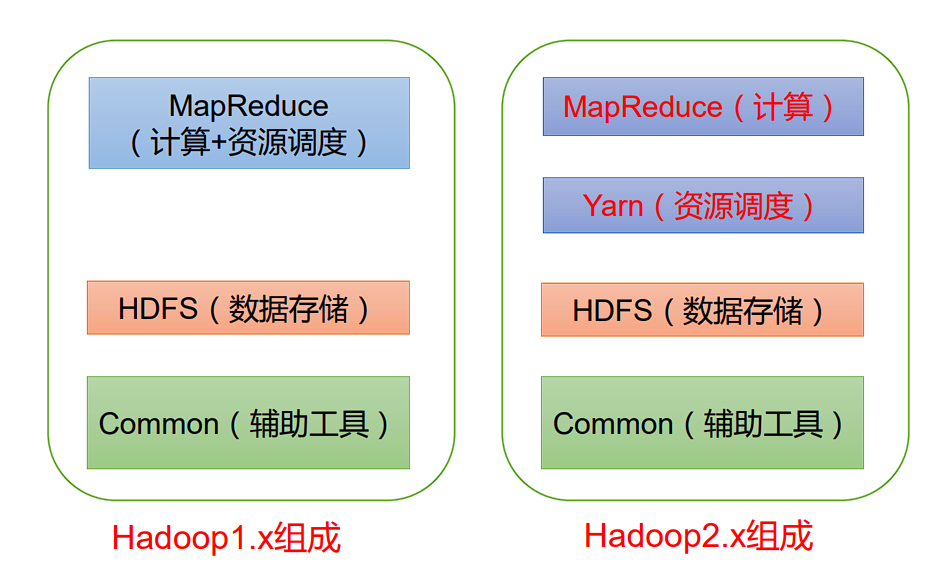

- 在 Hadoop1.x 时代 ， Hadoop中的`MapReduce`同时处理业务逻辑运算和资源的调度，耦合性较大。 
- 在 Hadoop2.x 时代，增加 了Yarn。Yarn只负责资源的调度,`MapReduce `只负责运算。 
- Hadoop3.x在组成上没有变化。

### HDFS 架构概述

Hadoop Distributed File System，简称 **HDFS**，是一个分布式文件系统

1. NameNode（nn）：存储文件的**元数据**，如**文件名，文件目录结构，文件属性**（生成时间、副本数、 文件权限），以及每个文件的**块列表**和**块所在的DataNode**等。
2. DataNode(dn)：在本地文件系统**存储文件块数据**，以及**块数据的校验和**。
3. Secondary NameNode(2nn)：**每隔一段时间对NameNode元数据备份**。

### YARN 架构概述

Yet Another Resource Negotiator 简称 YARN ，另一种资源协调者，是 Hadoop 的资源管理器

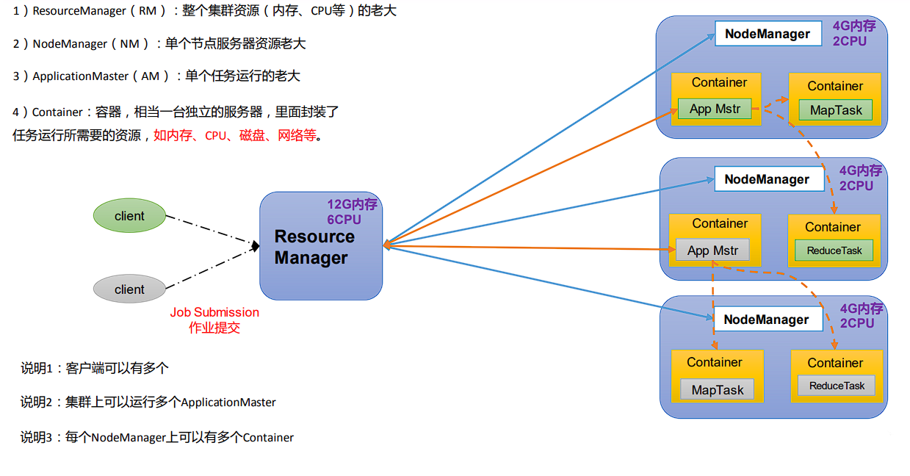

### MapReduce 架构概述

MapReduce 将计算过程分为两个阶段：`Map `和 `Reduce`

1. ``Map ``阶段并行处理输入数据
2. `Reduce `阶段对 `Map `结果进行汇总

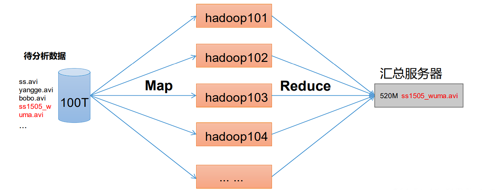

### HDFS、YARN、MapReduce 三者关系

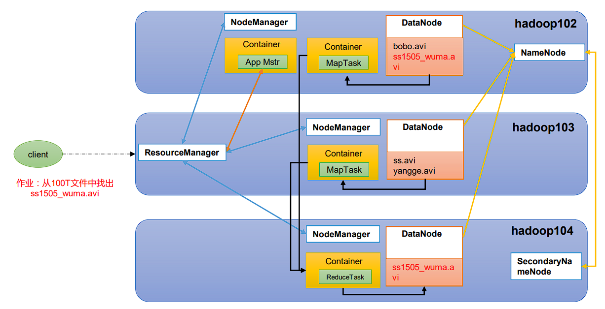

### 大数据技术生态体系

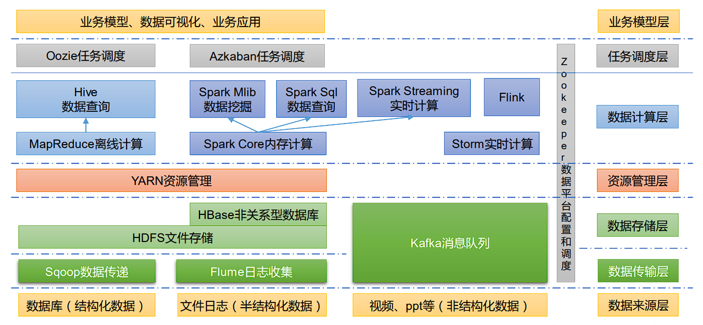

图中涉及的技术名词解释如下

1. Sqoop：Sqoop 是一款开源的工具，主要用于在 Hadoop、Hive 与传统的数据库（MySQL） 间进行数据的传递，可以将一个关系型数据库（例如 ：MySQL，Oracle 等）中的数据导进 到 Hadoop 的 HDFS 中，也可以将 HDFS 的数据导进到关系型数据库中
2. Flume：Flume 是一个高可用的，高可靠的，分布式的海量日志采集、聚合和传输的系统， Flume 支持在日志系统中定制各类数据发送方，用于收集数据
3. Kafka：Kafka 是一种高吞吐量的分布式发布订阅消息系统
4. Spark：Spark 是当前最流行的开源大数据内存计算框架。可以基于 Hadoop 上存储的大数 据进行计算
5. Flink：Flink 是当前最流行的开源大数据内存计算框架。用于实时计算的场景较多
6. Oozie：Oozie 是一个管理 Hadoop 作业（job）的工作流程调度管理系统
7. Hbase：HBase 是一个分布式的、面向列的开源数据库。HBase 不同于一般的关系数据库， 它是一个适合于非结构化数据存储的数据库
8. Hive：Hive 是基于 Hadoop 的一个数据仓库工具，可以将结构化的数据文件映射为一张 数据库表，并提供简单的 SQL 查询功能，可以将 SQL 语句转换为 MapReduce 任务进行运 行。其优点是学习成本低，可以通过类 SQL 语句快速实现简单的 MapReduce 统计，不必开 发专门的 MapReduce 应用，十分适合数据仓库的统计分析
9. ZooKeeper：它是一个针对大型分布式系统的可靠协调系统，提供的功能包括：配置维护、 名字服务、分布式同步、组服务等


### 推荐系统框架图

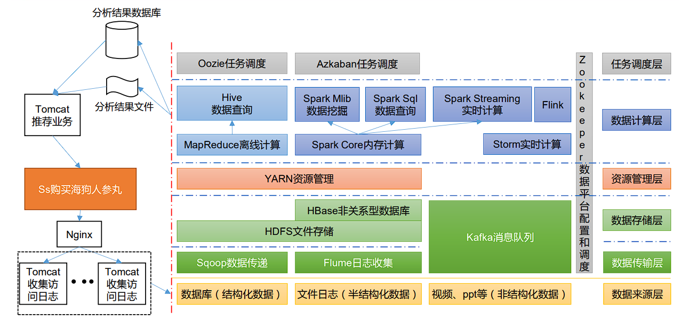

------


# 第二章 Hadoop 运行环境搭建

## Hadoop 目录结构

1. 查看 Hadoop 目录结构

   ```shell
   
   ```

2. 重要目录

   1. bin 目录：存放对 Hadoop 相关服务（hdfs，yarn，mapred）进行操作的脚本
   2. etc 目录：Hadoop 的配置文件目录，存放 Hadoop 的配置文件
   3. lib 目录：存放 Hadoop 的本地库（对数据进行压缩解压缩功能）
   4. sbin 目录：存放启动或停止 Hadoop 相关服务的脚本
   5. share 目录：存放 Hadoop 的依赖 jar 包、文档、和官方案例


------

# 第三章 Hadoop 运行模式

1. Hadoop 官方网站：http://hadoop.apache.org/
2. Hadoop 运行模式包括：本地模式、伪分布式模式以及完全分布式模式
   - 本地模式：单机运行，只是用来演示一下官方案例。**生产环境不用**
   - 伪分布式模式：也是单机运行，但是具备 Hadoop 集群的所有功能，一台服务器模 拟一个分布式的环境。**个别缺钱的公司用来测试，生产环境不用**
   - 完全分布式模式：多台服务器组成分布式环境。**生产环境使用**


## 本地运行模式

1. 创建在 hadoop-3.1.3 文件下面创建一个 wcinput 文件夹

   ```shell
   
   ```

2. 在 wcinput 文件下创建一个 word.txt 文件

   ```shell
   
   ```

3. 编辑 word.txt 文件

   ```shell
   
   ```

4. 回到 Hadoop 目录/opt/module/hadoop-3.1.3

5. 执行程序

   ```shell
   
   ```

6. 查看结果

   ```sheLl
   
   ```

## 完全分布式运行模式

1. 准备 3 台客户机（关闭防火墙、静态 IP、主机名称）
2. 安装 JDK
3. 配置环境变量
4. 安装 Hadoop
5. 配置环境变量
6. 配置集群
7. 单点启动
8. 配置 ssh
9. 群起并测试集群

### 编写集群分发脚本 xsync

1. `scp`（secure copy）安全拷贝

   1. scp 定义

      scp 可以实现服务器与服务器之间的数据拷贝。（from server1 to server2）

   2. 基本语法

      ```
      scp 			-r 			$pdir/$fname 					$user@$host:$pdir/$fname
      命令 		  	   递归 		要拷贝的文件路径/名称 			  目的地用户@主机:目的地路径/名称
      ```

      前提：在 hadoop102、hadoop103、hadoop104 都已经创建好的/opt/module

      /opt/software 两个目录，并且已经把这两个目录修改为 atguigu:atguigu

      ```shell
      
      ```

      1. 在 hadoop102 上，将 hadoop102 中/opt/module/jdk1.8.0_212 目录拷贝到 hadoop103 上

         ```shell
         
         ```

      2. 在 hadoop103 上，将 hadoop102 中/opt/module/hadoop-3.1.3 目录拷贝到 hadoop103 上

         ```shell
         
         ```

      3. 在 hadoop103 上操作，将 hadoop102 中/opt/module 目录下所有目录拷贝到 hadoop104 上

         ```shelll
         
         ```

2. `rsync `远程同步工具

   rsync 主要用于备份和镜像。具有速度快、避免复制相同内容和支持符号链接的优点

   > rsync 和 scp 区别：用 rsync 做文件的复制要比 scp 的速度快，rsync 只对差异文件做更 新。scp 是把所有文件都复制过去

 1.  基本语法

     ```
     rsync 			-av 			$pdir/$fname 			$user@$host:$pdir/$fname
     命令 			选项参数 		  要拷贝的文件路径/名称 		 目的地用户@主机:目的地路径/名称
     ```

     选项参数说明

     | 选项 | 功能         |
     | ---- | ------------ |
     | -a   | 归档拷贝     |
     | -v   | 显示复制过程 |

 2.  案例实操

     1.  删除 hadoop103 中/opt/module/hadoop-3.1.3/wcinput

         ```shell
         
         ```

     2.  同步 hadoop102 中的/opt/module/hadoop-3.1.3 到 hadoop103

         ```shell
         
         ```

 3.  xsync 集群分发脚本

     1.  需求：循环复制文件到所有节点的相同目录下

     2.  需求分析

         1.  rsync 命令原始拷贝

             ```
             rsync 	-av 	/opt/module 	atguigu@hadoop103:/opt/
             ```

         2.  期望脚本

             xsync 要同步的文件名称

         3.  期望脚本在任何路径都能使用（脚本放在声明了全局环境变量的路径）

             ```shell
             
             ```

     3.  脚本实现

         1.  在/home/atguigu/bin 目录下创建 xsync 文件

             ```shell
             
             ```

             在该文件中编写如下代码

             ```sh
             #!/bin/bash
             #1. 判断参数个数
             if [ $# -lt 1 ]; then
               echo Not Enough Arguement!
               exit
             fi
             
             #2. 遍历集群所有机器
             for host in hadoop102 hadoop103 hadoop104; do
               echo ==================== $host ====================
               #3. 遍历所有目录，挨个发送
               for file in $@; do
                 #4. 判断文件是否存在
                 if [ -e $file ]; then
                   #5. 获取父目录
                   pdir=$(
                     cd -P $(dirname $file)
                     pwd
                   )
                   #6. 获取当前文件的名称
                   fname=$(basename $file)
                   ssh $host "mkdir -p $pdir"
                   rsync -av $pdir/$fname $host:$pdir
                 else
                   echo $file does not exists!
                 fi
               done
             done
             
             ```

         2.  修改脚本 xsync 具有执行权限

             ```shell
             
             ```

         3.  测试脚本

             ```shell
             
             ```

         4.  将脚本复制到/bin 中，以便全局调用

             ```shell
             
             ```

         5.  同步环境变量配置（root 所有者）

             ```shell
             
             ```

             > 注意：如果用了 sudo，那么 xsync 一定要给它的路径补全

             让环境变量生效

             ```shell
             
             ```

### SSH 无密登录配置

1. 配置ssh

   1. 基本语法

      ssh 另一台电脑的 IP 地址

   2. ssh 连接时出现 Host key verification failed 的解决方法

      ```shell
      
      ```

      如果出现如下内容

      ```
      Are you sure you want to continue connecting (yes/no)? 
      输入 yes，并回车
      ```

   3. 退回到 hadoop102

      ```shell
      
      ```

2. 无密钥配置

   1. 免密登录原理

      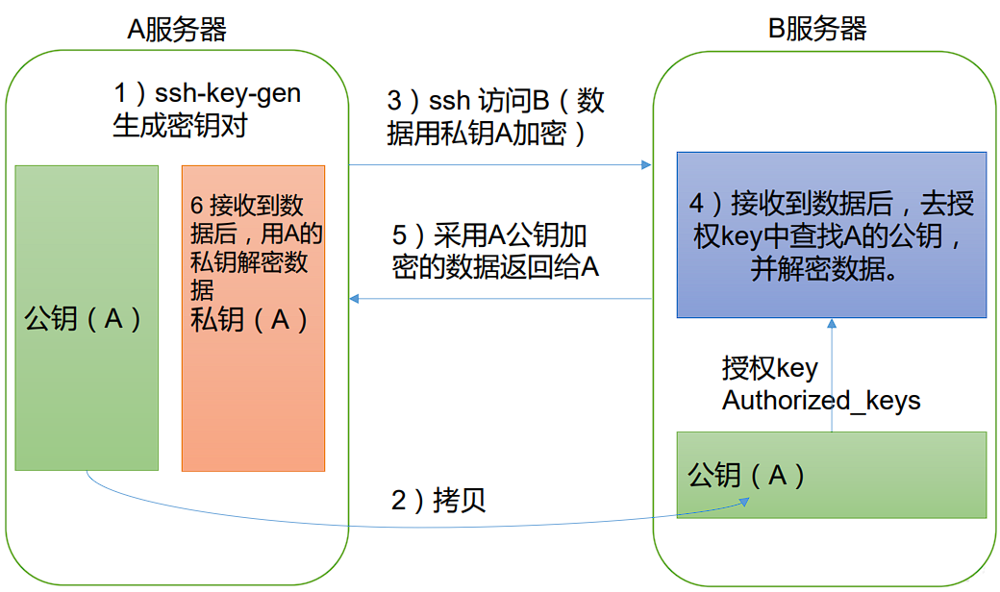

   2. 生成公钥和私钥

      ```shell
      
      ```

      然后敲（三个回车），就会生成两个文件 id_rsa（私钥）、id_rsa.pub（公钥）

   3. 将公钥拷贝到要免密登录的目标机器上

      ```shell
      
      
      ```

      > 注意： 
      >
      > - 还需要在 hadoop103 上采用 atguigu 账号配置一下无密登录到 hadoop102、hadoop103、 hadoop104 服务器上。 
      > - 还需要在 hadoop104 上采用 atguigu 账号配置一下无密登录到 hadoop102、hadoop103、 hadoop104 服务器上。 
      > - 还需要在 hadoop102 上采用 root 账号，配置一下无密登录到 hadoop102、hadoop103、 hadoop104

3. .ssh 文件夹下（~/.ssh）的文件功能解释

   | known_hosts     | 记录 ssh 访问过计算机的公钥（public key） |
   | --------------- | ----------------------------------------- |
   | id_rsa          | 生成的私钥                                |
   | id_rsa.pub      | 生成的公钥                                |
   | authorized_keys | 存放授权过的无密登录服务器公钥            |


### 集群配置

1. 集群部署规划

   > 注意：
   >
   > - `NameNode `和 `SecondaryNameNode `不要安装在同一台服务器
   > - `ResourceManager `也很消耗内存，不要和 `NameNode`、`SecondaryNameNode `配置在 同一台机器上

   |      | hadoop102                  | hadoop103                             | hadoop104                            |
   | ---- | -------------------------- | ------------------------------------- | ------------------------------------ |
   | HDFS | **NameNode**<br />DataNode | DataNode                              | **SecondaryNameNode** <br />DataNode |
   | YARN | NodeManager                | **ResourceManager** <br />NodeManager | NodeManager                          |

   

2. 配置文件说明

   Hadoop 配置文件分两类：默认配置文件和自定义配置文件，只有用户想修改某一默认 配置值时，才需要修改自定义配置文件，更改相应属性值

   1. 默认配置文件

      | 要获取的默认文件     | 文件存放在 Hadoop 的 jar 包中的位置                       |
      | -------------------- | --------------------------------------------------------- |
      | [core-default.xml]   | hadoop-common-3.1.3.jar/core-default.xml                  |
      | [hdfs-default.xml]   | hadoop-hdfs-3.1.3.jar/hdfs-default.xml                    |
      | [yarn-default.xml]   | hadoop-yarn-common-3.1.3.jar/yarn-default.xml             |
      | [mapred-default.xml] | hadoop-mapreduce-client-core-3.1.3.jar/mapred-default.xml |

   2. 自定义配置文件

      `core-site.xml`、`hdfs-site.xml`、`yarn-site.xml`、`mapred-site.xml` 四个配置文件存放在` $HADOOP_HOME/etc/hadoop` 这个路径上，用户可以根据项目需求重新进行修改配置

   3. 配置集群

      1. 核心配置文件

         配置 core-site.xml

         ```shell
         
         ```

         文件内容如下：

         ```xml
         
         ```

      2. HDFS 配置文件

         配置 hdfs-site.xml

         ```shell
         
         ```

         文件内容如下：

         ```xml
         
         ```

      3. YARN 配置文件

         配置 yarn-site.xml

         ```shell
         
         ```

         文件内容如下：

         ```xml
         
         ```

      4. MapReduce 配置文件

         配置 `mapred-site.xml`

         ```shell
         
         ```

         文件内容如下：

         ```xml
         
         ```

   4. 在集群上分发配置好的 Hadoop 配置文件

      ```shell
      
      ```

   5. 去 103 和 104 上查看文件分发情况

      ```shell
      
      ```

### 群起集群

1. 配置 workers

   ```shell
   
   ```

   在该文件中增加如下内容：

   ```
   
   ```

   > 注意：该文件中添加的内容结尾不允许有空格，文件中不允许有空行

   同步所有节点配置文件

   ```shell
   
   ```

2. 启动集群

   1. 如果集群是第一次启动，需要在 hadoop102 节点格式化 NameNode

      > 注意：格式 化 NameNode，会产生新的集群 id，导致 NameNode 和 DataNode 的集群 id 不一致，集群找 不到已往数据。如果集群在运行过程中报错，需要重新格式化 NameNode 的话，一定要先停 止 namenode 和 datanode 进程，并且要删除所有机器的 data 和 logs 目录，然后再进行格式化。

      ```shell
      
      ```

   2. 启动 HDFS

      ```shell
      
      ```

   3. 在配置了 ResourceManager 的节点（hadoop103）启动 YARN

      ```shell
      
      ```

   4. Web 端查看 HDFS 的 NameNode

      1. 浏览器中输入：http://hadoop102:9870
      2. 查看 HDFS 上存储的数据信息

   5. Web 端查看 YARN 的 ResourceManager

      1. 浏览器中输入：http://hadoop103:8088
      2. 查看 YARN 上运行的 Job 信息

3. 集群基本测试

   1. 上传文件到集群

      上传小文件

      ```shell
      
      ```

      上传大文件

      ```shell
      
      ```

   2. 上传文件后查看文件存放在什么位置

      查看 HDFS 文件存储路径

      ```shell
      
      ```

      查看 HDFS 在磁盘存储文件内容

      ```shell
      
      ```

   3. 拼接

      ```shell
      
      ```

   4. 下载

      ```shell
      
      ```

   5. 执行 wordcount 程序

      ```shell
      
      ```

### 配置历史服务器

为了查看程序的历史运行情况，需要配置一下历史服务器。具体配置步骤如下

1. 配置 `mapred-site.xml`

   ```shell
   
   ```

   在该文件里面增加如下配置。

   ```xml
   
   ```

2. 分发配置

   ```shell
   
   ```

3. 在 hadoop102 启动历史服务器

   ```shell
   
   ```

4. 查看历史服务器是否启动

   ```shell
   
   ```

5. 查看 JobHistory

   

### 配置日志的聚集

日志聚集概念：应用运行完成以后，将程序运行日志信息上传到 HDFS 系统上

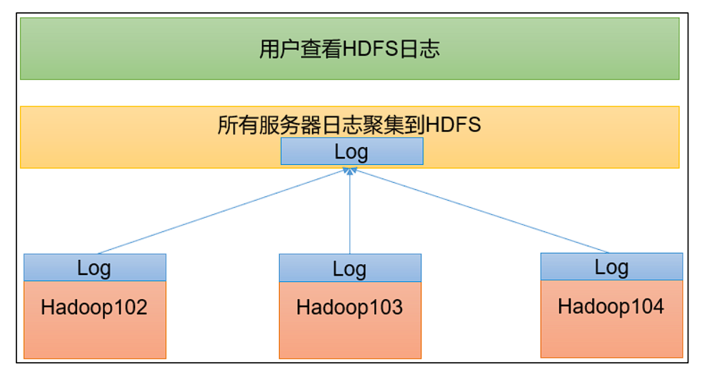

日志聚集功能好处：可以方便的查看到程序运行详情，方便开发调试

> 注意：开启日志聚集功能，需要重新启动 NodeManager 、ResourceManager 和 HistoryServer

开启日志聚集功能具体步骤如下

1. 配置 yarn-site.xml

   ```shell
   
   ```

   在该文件里面增加如下配置

   ```xml
   
   ```

2. 分发配置

   ```shell
   
   ```

3. 关闭 NodeManager 、ResourceManager 和 HistoryServer

   ```shell
   
   ```

4. 启动 NodeManager 、ResourceManage 和 HistoryServer

   ```shell
   
   ```

5. 删除 HDFS 上已经存在的输出文件

   ```shell
   
   ```

6. 执行 WordCount 程序

   ```shell
   
   ```

7. 查看日志

   1. 历史服务器地址

   2. 历史任务列表

      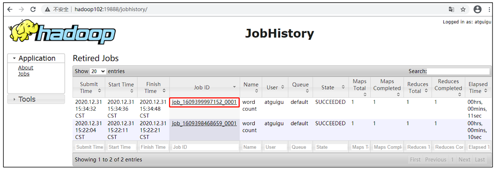

   3. 查看任务运行日志

      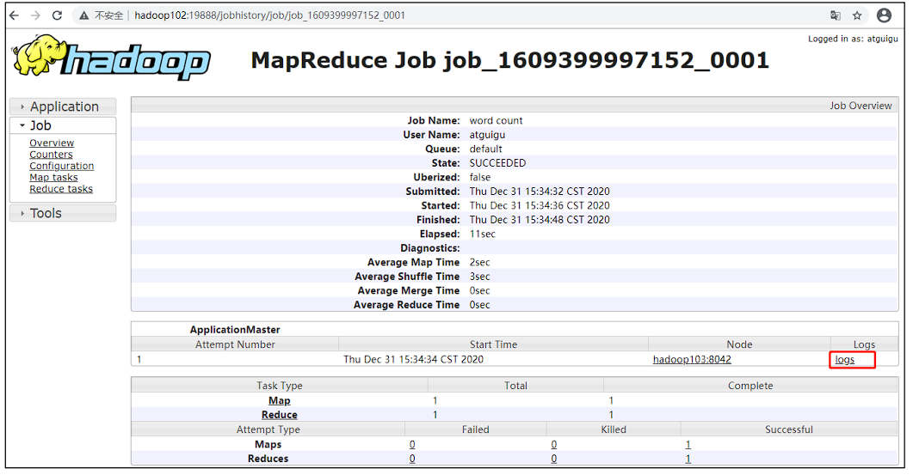
   4. 运行日志详情

      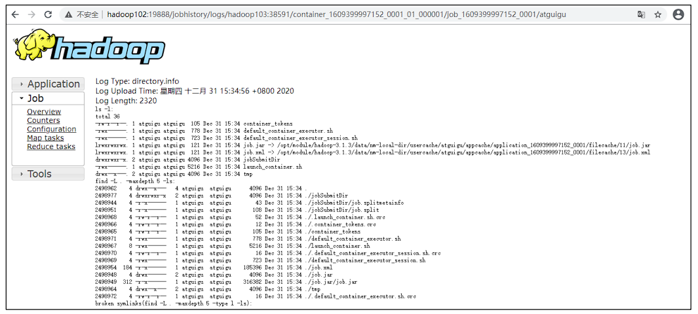

      
      
### 集群启动/停止方式总结

1. 各个模块分开启动/停止（配置 ssh 是前提）

   1. 整体启动/停止 HDFS

      ```
      
      ```

   2. 整体启动/停止 YARN

      ```
      
      ```

2. 各个服务组件逐一启动/停止

   1. 分别启动/停止 HDFS 组件

      ```
      
      ```

   2. 启动/停止 YARN

      ```
      
      ```


### 编写 Hadoop 集群常用脚本

1. Hadoop 集群启停脚本（包含 HDFS，Yarn，Historyserver）：myhadoop.sh

   ```shell
   
   ```

   输入如下内容

   ```sh
   #!/bin/bash
   if [ $# -lt 1 ]; then
     echo "No Args Input..."
     exit
   fi
   case $1 in
   "start")
     echo " =================== 启动 hadoop 集群 ==================="
     echo " --------------- 启动 hdfs ---------------"
     ssh hadoop102 "/opt/module/hadoop-3.1.3/sbin/start-dfs.sh"
     echo " --------------- 启动 yarn ---------------"
     ssh hadoop103 "/opt/module/hadoop-3.1.3/sbin/start-yarn.sh"
     echo " --------------- 启动 historyserver ---------------"
     ssh hadoop102 "/opt/module/hadoop-3.1.3/bin/mapred --daemon start
   historyserver"
     ;;
   "stop")
     echo " =================== 关闭 hadoop 集群 ==================="
     echo " --------------- 关闭 historyserver ---------------"
     ssh hadoop102 "/opt/module/hadoop-3.1.3/bin/mapred --daemon stop
   historyserver"
     echo " --------------- 关闭 yarn ---------------"
     ssh hadoop103 "/opt/module/hadoop-3.1.3/sbin/stop-yarn.sh"
     echo " --------------- 关闭 hdfs ---------------"
     ssh hadoop102 "/opt/module/hadoop-3.1.3/sbin/stop-dfs.sh"
     ;;
   *)
     echo "Input Args Error..."
     ;;
   esac
   ```

   保存后退出，然后赋予脚本执行权限

   ```shell
   
   ```

2. 查看三台服务器 Java 进程脚本：jpsall

   ```shell
   
   ```

   输入如下内容

   ```sh
   #!/bin/bash
   for host in hadoop102 hadoop103 hadoop104; do
     echo =============== $host ===============
     ssh $host jps
   done
   ```

3. 分发/home/atguigu/bin 目录，保证自定义脚本在三台机器上都可以使用

   ```shell
   
   ```


### 常用端口号说明

| 端口名称                   | Hadoop2.x   | Hadoop3.x        |
| -------------------------- | ----------- | ---------------- |
| NameNode 内部通信端口      | 8020 / 9000 | 8020 / 9000/9820 |
| NameNode HTTP UI           | 50070       | 9870             |
| MapReduce 查看执行任务端口 | 8088        | 8088             |
| 历史服务器通信端口         | 19888       | 19888            |


### 集群时间同步

**如果服务器在公网环境（能连接外网），可以不采用集群时间同步**，因为服务器会定期 和公网时间进行校准；

如果服务器在内网环境，必须要配置集群时间同步，否则时间久了，会产生时间偏差， 导致集群执行任务时间不同步

1. 需求

   找一个机器，作为时间服务器，所有的机器与这台集群时间进行定时的同步，生产环境 根据任务对时间的准确程度要求周期同步。测试环境为了尽快看到效果，采用 1 分钟同步一 次

   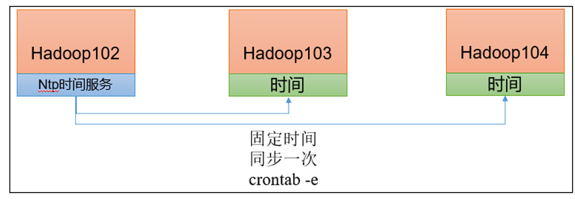

2. 时间服务器配置（必须 root 用户）

   1. 查看所有节点 ntpd 服务状态和开机自启动状态

      ```shell
      
      ```

   2. 修改 hadoop102 的 ntp.conf 配置文件

      ```shell
      
      ```

      修改内容如下

      1. 修改 1（授权 192.168.10.0-192.168.10.255 网段上的所有机器可以从这台机器上查 询和同步时间）

         ```
         
         ```

         

         ```
         
         ```

         

      2. 修改 2（集群在局域网中，不使用其他互联网上的时间）

         ```
         
         ```

         

         ```
         
         ```

         

      3. 添加 3（当该节点丢失网络连接，依然可以采用本地时间作为时间服务器为集群中 的其他节点提供时间同步）

         ```
         
         ```

   3. 修改 hadoop102 的/etc/sysconfig/ntpd 文件

      ```shell
      
      ```

      增加内容如下（让硬件时间与系统时间一起同步）

      ```
      
      ```

   4. 重新启动 ntpd 服务

      ```shell
      
      ```

   5. 设置 ntpd 服务开机启动

      ```shell
      
      ```

3. 其他机器配置（必须 root 用户）

   1. 关闭所有节点上 ntp 服务和自启动

      ```shell
      
      ```

      

   2. 在其他机器配置 1 分钟与时间服务器同步一次

      ```
      
      ```

      编写定时任务如下：

      ```
      
      ```

   3. 修改任意机器时间

      ```shell
      
      ```

   4. 1 分钟后查看机器是否与时间服务器同步

      ```shell
      
      ```


------

# 第四章 常见错误及解决方案

1. 防火墙没关闭、或者没有启动 YARN

   ```
   INFO client.RMProxy: Connecting to ResourceManager at hadoop108/192.168.10.108:8032
   ```

2. 主机名称配置错误

3. IP 地址配置错误

4. ssh 没有配置好

5. root 用户和 atguigu 两个用户启动集群不统一

6. 配置文件修改不细心

7. 不识别主机名称

   ```
   
   java.net.UnknownHostException: hadoop102: hadoop102
    at
   java.net.InetAddress.getLocalHost(InetAddress.java:1475)
    at
   org.apache.hadoop.mapreduce.JobSubmitter.submitJobInternal(Job
   Submitter.java:146)
    at org.apache.hadoop.mapreduce.Job$10.run(Job.java:1290)
    at org.apache.hadoop.mapreduce.Job$10.run(Job.java:1287)
    at java.security.AccessController.doPrivileged(Native
   Method)
   at javax.security.auth.Subject.doAs(Subject.java:415)
   ```

   解决办法：

   1. 在/etc/hosts 文件中添加 192.168.10.102 hadoop102
   2. 主机名称不要起 hadoop hadoop000 等特殊名称

8. DataNode 和 NameNode 进程同时只能工作一个

   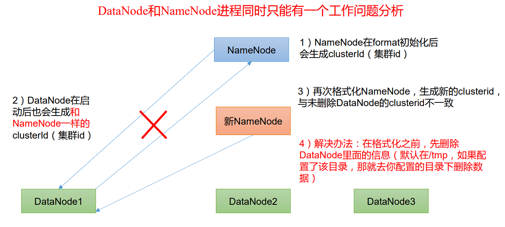

9. 执行命令不生效，粘贴 Word 中命令时，遇到-和长–没区分开。导致命令失效

   解决办法：尽量不要粘贴 Word 中代码

10. jps 发现进程已经没有，但是重新启动集群，提示进程已经开启

    原因是在 Linux 的根目录下/tmp 目录中存在启动的进程临时文件，将集群相关进程删 除掉，再重新启动集群

11. jps 不生效

    原因：全局变量 hadoop java 没有生效。解决办法：需要 source /etc/profile 文件

12. 8088 端口连接不上

    ```
    [atguigu@hadoop102 桌面]$ cat /etc/hosts
    ```

    注释掉如下代码

    ```
    #127.0.0.1 localhost localhost.localdomain localhost4 localhost4.localdomain4
    #::1 hadoop102
    ```

    

​      